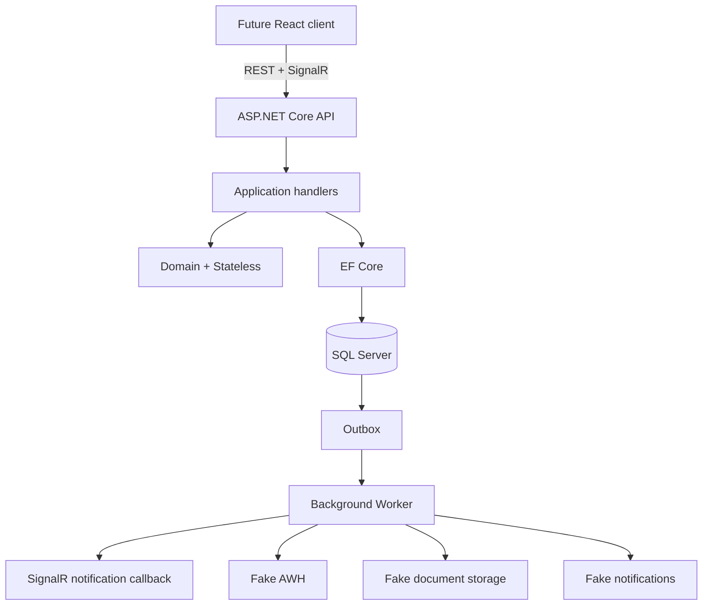

# SwiftReview

Рабочий backend-прототип обработки и многоуровневого review SWIFT-сообщений. Это modular monolith на .NET 10 и SQL Server: UI не требуется, полный workflow доступен через REST, OpenAPI/Scalar и SignalR.

## Архитектура



Зависимости направлены внутрь: `Domain` не зависит от persistence/API, `Application` зависит только от domain contracts, а SQL Server и внешние adapters находятся в `Infrastructure`. Stateless валидирует transitions, но не выполняет persistence. Business data, audit и outbox сохраняются одним EF Core `SaveChanges`/transaction.

Основные возможности:

- configurable 1/2/3-step workflows и состояния `New` → reviews → `Completed`/`Rejected`;
- four-eyes, запрет self-assignment, повторного approve и invalid transitions;
- atomic permissions, branch/department scope и resource-based authorization;
- SQL-side filtering, sorting, pagination и permission-scoped dashboard counts;
- SQL Server `rowversion`, конфликт устаревшей команды возвращается как HTTP 409;
- append-only audit trail и retryable outbox с atomic SQL claim, lease owner и idempotency key;
- SignalR groups `branch:{id}`, `department:{id}`, `message:{id}` с server-side membership checks;
- OpenAPI, Scalar, ProblemDetails, correlation IDs, logs и OpenTelemetry instrumentation;
- fake AWH ingestion, document storage и notifications.

## Требования

- Docker Engine / Docker Desktop с Compose; либо .NET SDK 10.0.100 и доступный SQL Server.
- Порты `1433` и `5080` должны быть свободны.

## Запуск одной командой

```bash
docker compose -f backend/docker-compose.yml up --build
```

Compose запускает SQL Server, дожидается health check, применяет initial migration только в Development bootstrap, затем запускает API и Worker.

- API: <http://localhost:5080>
- Scalar: <http://localhost:5080/scalar>
- OpenAPI: <http://localhost:5080/openapi/v1.json>
- SignalR hub: `http://localhost:5080/hubs/messages`
- Health: <http://localhost:5080/health>

Остановка:

```bash
docker compose -f backend/docker-compose.yml down
```

Добавьте `-v` только если нужно намеренно удалить локальный SQL volume.

## Запуск из IDE / CLI

Поднять только SQL Server:

```bash
cd backend
docker compose up -d sqlserver
dotnet tool restore
dotnet ef database update --project src/SwiftReview.Infrastructure --startup-project src/SwiftReview.Api
dotnet run --project src/SwiftReview.Api
dotnet run --project src/SwiftReview.Worker
```

Connection string находится в `appsettings.json` и может быть переопределён через `ConnectionStrings__SwiftReview`. Production startup автоматически migrations не применяет. Development bootstrap включается параметром `BootstrapDatabase=true`.

Создание новой migration:

```bash
cd backend
dotnet ef migrations add MigrationName \
  --project src/SwiftReview.Infrastructure \
  --startup-project src/SwiftReview.Api \
  --output-dir Persistence/Migrations
```

## Development authentication

Header `X-Debug-User` работает только в `Development`:

- `cs-reviewer`
- `tfo-reviewer`
- `dc-reviewer`
- `dc-senior`
- `supervisor`
- `admin`

Публичный import endpoint требует отдельный `message.import`, который в seed назначен только `admin`; штатный AWH ingestion вызывает application handler непосредственно из Worker.

Пример:

```bash
curl -H 'X-Debug-User: supervisor' http://localhost:5080/api/me
curl -H 'X-Debug-User: supervisor' http://localhost:5080/api/dashboard/summary
curl -H 'X-Debug-User: supervisor' http://localhost:5080/api/workflows
curl -H 'X-Debug-User: supervisor' http://localhost:5080/api/users
```

В production вместо debug handler подключается реальный authentication adapter (например, Entra ID); application/domain от конкретного identity provider не зависят.

## API examples

Server-side grid:

```bash
curl -X POST http://localhost:5080/api/messages/search \
  -H 'Content-Type: application/json' \
  -H 'X-Debug-User: supervisor' \
  -d '{
    "skip": 0,
    "take": 25,
    "sort": [{"field":"receivedAt","direction":"desc"}],
    "filter": {"states":[],"branches":[],"messageTypes":[],"departments":[],"dateFrom":null,"dateTo":null,"account":null,"currency":"EUR"}
  }'
```

Для mutating endpoints сначала получите message и передайте возвращённый Base64 `rowVersion`:

```bash
curl -X POST http://localhost:5080/api/messages/1/assign \
  -H 'Content-Type: application/json' \
  -H 'X-Debug-User: supervisor' \
  -d '{"assignedTo":1,"rowVersion":"<value-from-GET>"}'
```

Полный контракт requests/responses, enums, nullable fields, ProblemDetails, 403/409 и pagination опубликован в OpenAPI и пригоден как input для Orval.

## Fake integrations и worker

- `FakeAwhClient` генерирует сообщения; `ExternalId` обеспечивает idempotent import, а internal workflow resolver выбирает конфигурацию по type/department/branch.
- `FakeDocumentStorage` логирует сохранение confirmation.
- `FakeNotificationSender` логирует recipient/message/event.
- Worker атомарно забирает outbox records через SQL Server `UPDLOCK/READPAST`, использует lease owner, exponential retry и передаёт стабильный idempotency key всем side effects.
- Worker передаёт API только `{ type, messageId, version, branchId, departmentId }`; клиенты перечитывают REST/SQL source of truth.

Production HTTP adapter slot зарегистрирован через `HttpClientFactory` с timeout, retry и circuit breaker; реальные AWH/SharePoint/SMTP/Teams implementations сознательно не входят в прототип.

OpenTelemetry instrumentation включён в API и Worker. Для отправки traces/metrics через OTLP задайте `OTEL_EXPORTER_OTLP_ENDPOINT`.

## Тесты

```bash
cd backend
dotnet restore SwiftReview.sln --configfile NuGet.Config
dotnet build SwiftReview.sln --no-restore
dotnet test SwiftReview.sln --no-build --no-restore
```

Domain/application tests и host-level проверки OpenAPI, Scalar, SignalR mapping и authorization выполняются всегда. SQL Server integration suite использует Testcontainers и не использует EF InMemory. Для явного запуска при доступном Docker:

```bash
cd backend
RUN_INTEGRATION_TESTS=1 dotnet test tests/SwiftReview.IntegrationTests
```

Integration suite проверяет migration/seed, import и duplicate import, assignment, review/complete, audit, permissions и branch scope, SQL filtering/pagination, outbox и конфликт двух конкурентных EF contexts.

## Seed data

Initial migration создаёт London/Dublin/Singapore, CS/TFO/DC, шесть roles/users, atomic permissions и восемь type-specific workflows. В них входят обязательные варианты `Single Review`, `Two Reviews`, `Three Reviews`. Все 75 сообщений имеют согласованные state/workflow/assignment/review/audit данные с разными type/date/branch/department; raw SWIFT payload хранится отдельно в `MessageRawData`.

## Ограничения прототипа

Нет реальных Entra ID/AWH/SharePoint/notification adapters, message broker, distributed SignalR backplane или production secrets management. Internal Worker → API notification callback выбран для запуска API и Worker отдельными процессами без добавления запрещённого broker. При масштабировании Worker/API этот transport следует заменить production adapter/backplane, не меняя domain workflow.
