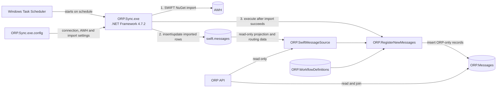
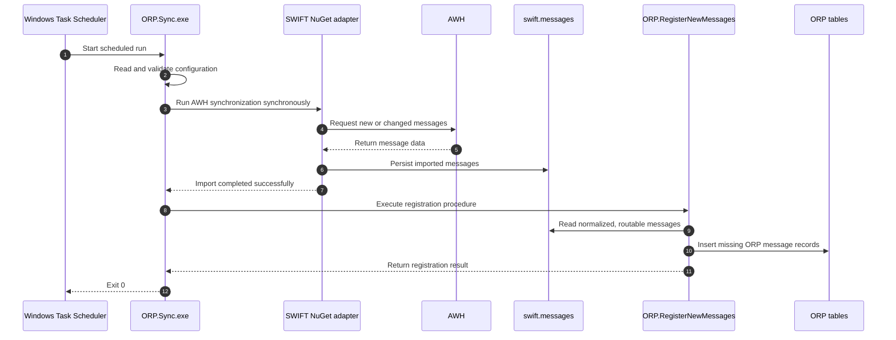
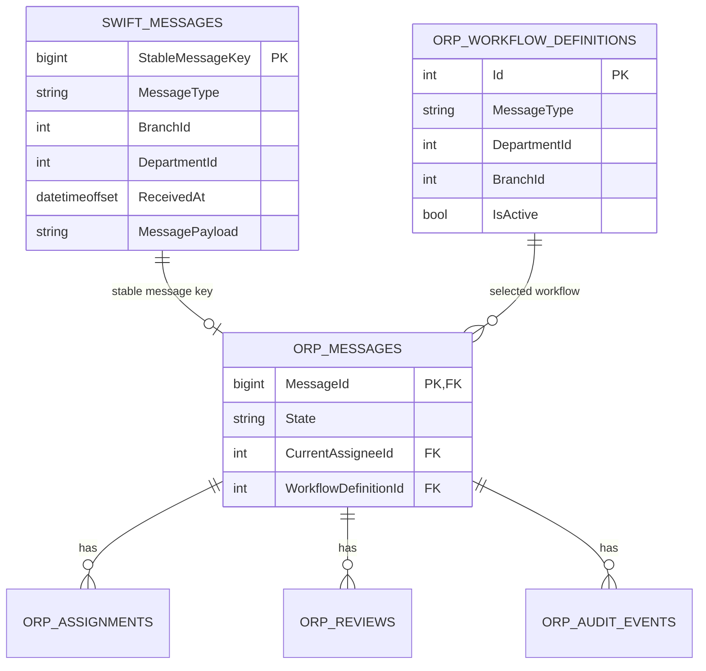
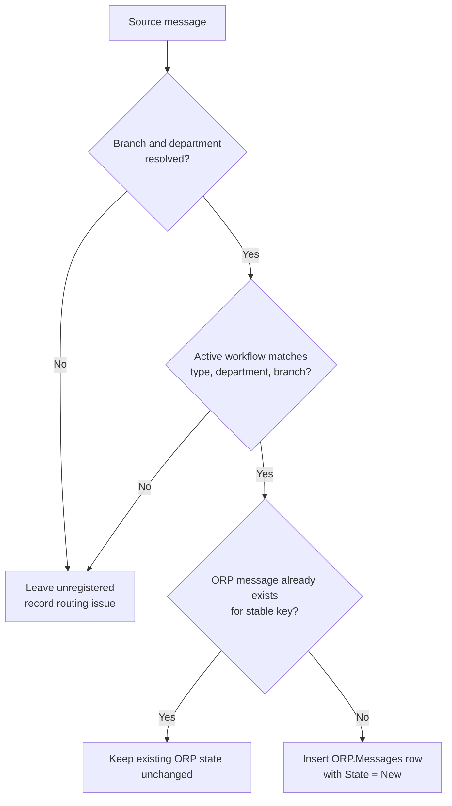

# AWH Message Ingestion and ORP Registration

## 1. Purpose

This document describes how SWIFT messages will be loaded from AWH into the local database and registered in the Operations Reporting and Processing (ORP) application.

The design has two deliberately separate stages:

1. **AWH ingestion** imports the SWIFT-owned message data into `[swift].[messages]`.
2. **ORP registration** creates only the ORP-owned state that does not exist in the SWIFT data, such as workflow, assignment, review, and audit state.

The original SWIFT message payload is not copied into the `[ORP]` schema. ORP reads that data from the read-only SWIFT source and joins it to its own records by a stable message key.

## 2. Proposed architecture

The integration will be hosted by a small one-shot .NET Framework 4.7.2 console application (the current `net472` target). Windows Task Scheduler is the preferred production host because the process has a finite, scheduled workload and already exposes success or failure through its exit code. A Windows Service remains an option if future requirements demand continuous polling or more complex service control.



### Component responsibilities

| Component | Responsibility | Data access |
|---|---|---|
| `ORP.Sync.exe` | Orchestrate one complete import run in the correct order | Executes the SWIFT adapter and the ORP registration procedure |
| SWIFT NuGet adapter | Connect to AWH and materialize SWIFT messages locally | Reads AWH; writes `[swift].[messages]` |
| `[swift].[messages]` | Durable local copy of the imported SWIFT message data | Written only by the importer; read by ORP integration and API paths |
| `[ORP].[SwiftMessageSource]` | Normalize SWIFT columns and derive `MessageType`, `BranchId`, and `DepartmentId` for ORP | Read-only view over `[swift].[messages]` and, if needed, routing reference data |
| `[ORP].[RegisterNewMessages]` | Register messages that have a matching active workflow and are not registered yet | Reads the source view and workflow configuration; atomically inserts `[ORP].[Messages]` and `MessageRegistered` audit events |
| `[ORP]` tables | Store only ORP-specific workflow data | Owned and updated by ORP |

`[swift].[messages]` is read-only from the ORP application's perspective. The dedicated import identity is the only component that requires write permission to it.

## 3. End-to-end processing sequence



Registration must not start until the SWIFT NuGet operation has completed successfully. If either stage fails, the executable logs the error and exits with a non-zero code so that Task Scheduler can retry and operations can alert on the failure.

## 4. Data ownership and relationship

The two schemas have different ownership boundaries:



The intended cardinality is:

- One imported SWIFT message has zero or one `[ORP].[Messages]` row.
- A message has no ORP row while it is new, cannot be routed, or is outside the ORP scope.
- Once it is successfully routed, exactly one ORP row is created.
- The primary/unique key on `[ORP].[Messages]` enforces the ORP side of this one-to-one relationship.

A physical foreign key from `[ORP].[Messages]` to `[swift].[messages]` is optional and should be added only after the stable key and source retention policy are confirmed. If ORP continues to consume a view, the relationship remains logical because SQL Server cannot reference a view with a normal foreign key. No cascade delete should be configured across the schema boundary.

### Data retained in each schema

| SWIFT-owned data, read by ORP | ORP-owned data |
|---|---|
| External/business identifier | Registration key |
| Message type | Workflow definition reference |
| Sender and receiver | Current ORP state |
| Account, currency, and amount | Current assignee |
| Reference and received timestamp | Assignment history |
| Raw message/body and other AWH attributes | Reviews and audit events |
| Derived or mapped branch and department | Other ORP-only processing metadata |

Message content is intentionally not duplicated in `[ORP]`. Consequently, the imported SWIFT row must remain available for the full ORP retention period. Deleting it would leave the ORP workflow record without its source data and, with the current inner-join read model, make the message disappear from API query results.

## 5. Message routing and registration

The normalized source consumed by ORP must expose at least the following contract:

| Column | Type | Purpose |
|---|---|---|
| `MessageID` | `bigint` | Stable join/registration key; final choice is still open |
| `ExternalId` | `nvarchar(100)` | User-facing or business identifier |
| `MessageType` | `nvarchar(20)` | Workflow selection |
| `BranchId` | `int` | Access scope and workflow selection |
| `DepartmentId` | `int` | Access scope and workflow selection |
| `ReceivedAt` | `datetimeoffset` | Display, filtering, and ordering |
| `Sender` / `Receiver` | `nvarchar(100)` | Message details |
| `Account` | `nvarchar(100)`, nullable | Message details and filtering |
| `Currency` | `nvarchar(3)`, nullable | Message details and filtering |
| `Amount` | `decimal(19,4)`, nullable | Message details and aggregation |
| `Reference` | `nvarchar(200)`, nullable | Message details |

Branch and department are determined from the imported message according to routing rules that still need to be supplied. The preferred boundary is `[ORP].[SwiftMessageSource]`: it hides the physical SWIFT table layout from the rest of ORP and exposes one stable, read-only contract.

For each routable source message, registration resolves an active workflow using:

1. exact `MessageType`;
2. exact `DepartmentId`;
3. exact `BranchId`, preferred over a workflow whose `BranchId` is `NULL` (the branch-independent fallback).

Registration then inserts this minimal row:

```text
[ORP].[Messages]
    MessageId            = source stable key
    State                = "New"
    CurrentAssigneeId    = NULL
    WorkflowDefinitionId = resolved workflow
```

Existing ORP rows are never updated or re-created by synchronization. In particular, rerunning the job must not reset state, assignment, reviews, or audit history.
Each newly inserted row receives exactly one system-authored `MessageRegistered` event; repeated registration runs do not add another event.



Unroutable messages should remain in `[swift].[messages]` and be visible through operational logging or a reconciliation query. The current procedure silently skips them; production readiness requires an agreed alerting or exception-handling rule.

## 6. Idempotency, consistency, and recovery

Both stages must be safe to rerun.

- The importer identifies already imported AWH records by the selected stable key and follows the SWIFT NuGet package's supported insert/update behavior.
- `[ORP].[Messages].[MessageId]` is unique and registration inserts only when that key is absent.
- Existing ORP workflow data is never overwritten by an import retry.
- Task Scheduler should be configured to prevent overlapping instances of the job.
- If AWH ingestion succeeds but ORP registration fails, the next run reuses the already imported SWIFT rows and retries registration.
- If a single source record cannot be mapped, other valid records should be handled according to the agreed error policy; the unmapped record must not be discarded.

There is no requirement for a distributed transaction spanning AWH and the ORP database. The durable source table plus idempotent registration provide recovery across the stage boundary.

Because ORP does not copy source attributes, changes to `MessageType`, `BranchId`, or `DepartmentId` after registration need a defined policy. The safest default is to treat these routing attributes as immutable after the ORP row is created. Otherwise the displayed/access-controlled scope could change while the already selected workflow remains unchanged.

## 7. Hosting and configuration

### Recommended option: Windows Task Scheduler

Use the console application as a one-shot executable and configure:

- a schedule agreed with operations;
- “do not start a new instance” when a previous run is still active;
- retries for non-zero exit codes, for example three retries at 15-minute intervals;
- a dedicated least-privilege Windows account;
- capture/forwarding of standard output, standard error, and exit code;
- a maximum runtime appropriate for the expected AWH volume.

This option is simpler to deploy and operate than a continuously running service for a periodic batch.

### Alternative: Windows Service

A service is justified only if near-real-time polling, dynamic schedules, long-lived connections, or service-specific health/control requirements appear. The two-stage orchestration and database ownership rules remain the same.

### Configuration file

All environment-dependent values are read at startup from `ORP.Sync.exe.config`; none are compiled into the executable or supplied as plaintext command-line arguments. Expected configuration includes:

- ORP/SQL Server connection string;
- AWH/SWIFT NuGet connection and authentication settings required by the package;
- import window, batch size, timeout, and retry settings supported by the adapter;
- registration command timeout;
- logging destination and level;
- optional instance-lock or job-name setting.

The deployed configuration file must be protected with an ACL that grants access only to administrators and the job identity. Secrets should use the deployment environment's approved protection mechanism if the legacy package supports it.

## 8. Permissions

Use separate database identities where practical:

| Identity | Minimum permissions |
|---|---|
| Import job | Execute the SWIFT import path; write required rows in `[swift].[messages]`; execute `[ORP].[RegisterNewMessages]`; write job logs if stored in SQL |
| ORP API | Select from `[ORP].[SwiftMessageSource]` and ORP tables; normal ORP application permissions; no insert/update/delete on `[swift].[messages]` |
| Deployment/migration identity | Create/alter required schemas, view, procedure, indexes, and permissions; not used at runtime |

## 9. Observability and acceptance criteria

Each run should report at least:

- run identifier, start/end time, and duration;
- AWH rows read, inserted, updated, and rejected;
- source rows evaluated for ORP registration;
- ORP rows inserted and already present;
- rows skipped because routing data or a workflow was missing;
- final result and error details without message payloads or credentials.

The design is accepted when the following scenarios are verified:

1. A successful run imports AWH messages and registers every eligible new message.
2. A second run with no AWH changes creates no duplicate ORP records.
3. A retry after registration failure completes without reinitializing existing workflows.
4. Existing assignment, review, and audit state remains unchanged after repeated imports.
5. A message with no routing/workflow match is retained and observable.
6. The ORP runtime identity cannot modify `[swift].[messages]`.
7. Concurrent job instances are prevented or safely serialized.
8. Source retention preserves message details for every retained ORP workflow.

## 10. Alignment with the current codebase

The repository already implements the core shape of this design:

| Current implementation | Alignment or required change |
|---|---|
| `src/ORP.Sync/Program.cs` runs the legacy synchronizer and then `[ORP].[RegisterNewMessages]` | Aligned with the required stage order |
| `ORP.Sync` is a one-shot executable intended for Task Scheduler | Aligned with the recommended host |
| `LegacySwiftSynchronizer.Run` currently throws a fail-fast exception | SWIFT NuGet package and its synchronous import call must be integrated |
| `ORP.Sync` targets .NET Framework 4.7.2 (`net472`) | Aligned; retain the current target and confirm that the legacy SWIFT NuGet package supports it |
| Only the `ORP` connection string is currently read from `App.config` | Add the package-specific AWH and operational settings |
| `[ORP].[SwiftMessageSource]` is currently an empty bootstrap view | Replace it with a projection over `[swift].[messages]` and implement the agreed routing rules |
| Existing comments/documentation refer to `[dbo].[Messages]` | Update them to the confirmed `[swift].[messages]` source |
| `[ORP].[RegisterNewMessages]` inserts only absent keys, initializes `State = New`, and writes `MessageRegistered` in the same transaction | Aligned with idempotent ORP registration and auditability |
| Workflow resolution prefers an exact branch and falls back to `BranchId IS NULL` | Aligned; confirm that this is the desired business rule |
| ORP queries join `[ORP].[Messages]` to the source view instead of copying payload fields | Aligned with the no-copy requirement; requires durable source retention |
| EF Core blocks writes to `SwiftMessageRecord` through the ORP context | Aligned with the read-only boundary |
| Current registration silently skips messages without a workflow match | Add reconciliation/monitoring and agree whether the run should warn or fail |

## 11. Decisions required before implementation

1. **Stable relationship key:** choose `MessageID` or `WarehouseID`. The selected column must be non-null, unique, immutable, available in every AWH import, and retained for the complete ORP lifetime. Prefer `WarehouseID` if it is the immutable AWH row identifier and `MessageID` is a business identifier that can repeat or change. Otherwise keep the current `MessageID` design.
2. **Routing rules:** define exactly how message body/headers map to `BranchId` and `DepartmentId`, including unknown and ambiguous cases.
3. **Source contract:** confirm the actual `[swift].[messages]` columns, data types, indexes, and whether the SWIFT NuGet package creates/owns this schema.
4. **Import semantics:** confirm whether AWH rows are insert-only or whether corrections update existing source rows.
5. **Retention:** confirm that source records will not be purged before the corresponding ORP data and that routing attributes are immutable after registration, or define an archival/snapshot strategy.
6. **Unroutable messages:** decide whether missing routing/workflow matches produce a warning, fail the run, or enter a dedicated reconciliation queue/table.
7. **Schedule and service-level objective:** define import frequency, expected volume, acceptable delay, timeout, and retry policy.
8. **Hosting:** approve Task Scheduler as the initial host or provide a requirement that makes a Windows Service necessary.
