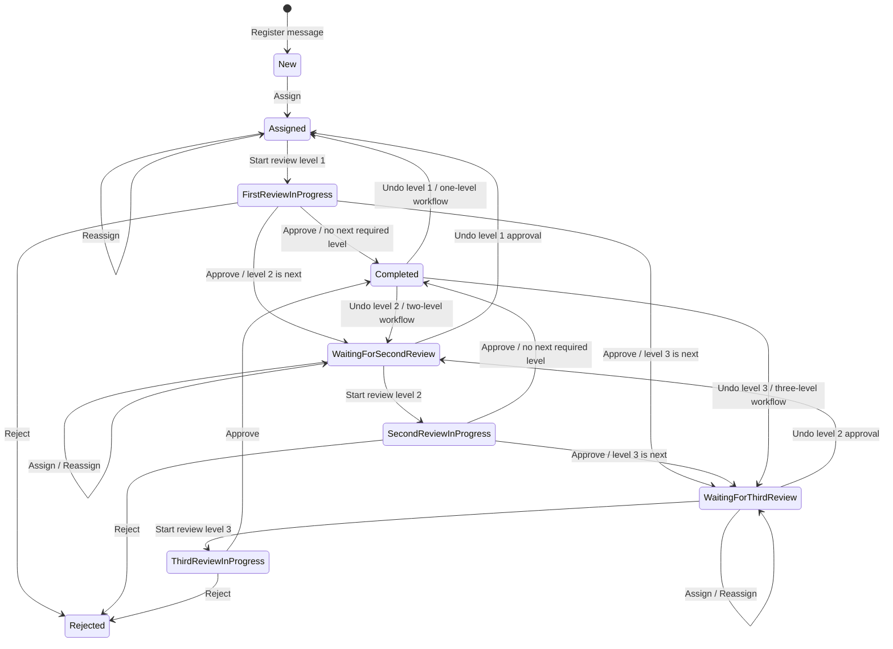
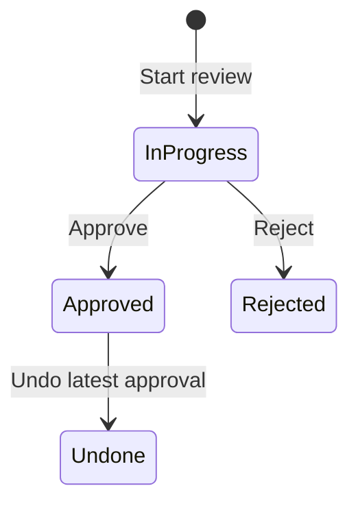

# ORP Message State Machine

## Purpose

This document describes the message workflow states and every transition currently implemented by ORP. A workflow can require one, two, or three review levels. Optional levels are skipped.

## Complete message flow



Only required workflow levels take part in the approval sequence. An optional level does not block completion. The diagram shows the standard sequential level 1 to level 2 to level 3 configurations; the implementation selects the next required level from the workflow definition.

## States

| State | Meaning | Available state-changing actions |
|---|---|---|
| `New` | The message has been registered in ORP but has no assignee | `Assign` |
| `Assigned` | The message is waiting for the first review; after undo it may be unassigned | `Assign`, `StartReview(1)`, `Reassign` |
| `FirstReviewInProgress` | A level 1 review is active | `Approve`, `Reject` |
| `WaitingForSecondReview` | Level 1 is approved and level 2 is required | `Assign`, `StartReview(2)`, `Undo`, `Reassign` |
| `SecondReviewInProgress` | A level 2 review is active | `Approve`, `Reject` |
| `WaitingForThirdReview` | Earlier required levels are approved and level 3 is required | `Assign`, `StartReview(3)`, `Undo`, `Reassign` |
| `ThirdReviewInProgress` | A level 3 review is active | `Approve`, `Reject` |
| `Completed` | All required review levels are approved | `Undo` latest approval |
| `Rejected` | An active review has rejected the message | No state-changing actions; there is currently no reopen transition |

There is no separate `WaitingForFirstReview` state. `Assigned` represents that condition.

## What each action is for

| Action | Purpose | Result |
|---|---|---|
| `Assign` | Give an unassigned message to the reviewer responsible for the current level | Sets the assignee; moves `New` to `Assigned` and preserves other waiting states |
| `Reassign` | Transfer responsibility to another eligible person without restarting the workflow | Changes the assignee but preserves the message state and completed review history |
| `StartReview` | Begin the next required review level and identify the reviewer responsible for it | Creates an `InProgress` review and moves the message into the corresponding review-in-progress state |
| `Approve` | Confirm that the message has passed the active review level | Marks the review `Approved` and moves to the next required level or to `Completed` |
| `Reject` | Record a negative review decision because the message must not continue through the approval workflow | Marks the active review `Rejected` and moves the whole message to `Rejected`; a comment is optional |
| `Undo` | Withdraw the reviewer's own most recent approval when it was given by mistake or must be reconsidered | Marks that approval `Undone` and reopens the same review level without deleting its history |

### Undo compared with Reject

`Reject` is a decision made while a review is currently in progress. It means that the reviewer does not approve the message and stops the normal approval flow. A rejection comment is optional, and the message enters `Rejected`.

`Undo` is a correction made after an approval has already been recorded. It does not reject the message. It withdraws only the latest approval, returns the message to the point immediately before that review, and allows the level to be reviewed again. Only the person who made that approval can undo it.

In short:

```text
Reject = "I reviewed this message and do not approve it."
Undo   = "I previously approved this message, but I withdraw that approval."
```

## Standard approval paths

```text
One required level:
New -> Assigned -> FirstReviewInProgress -> Completed

Two required levels:
New -> Assigned -> FirstReviewInProgress
    -> WaitingForSecondReview -> SecondReviewInProgress -> Completed

Three required levels:
New -> Assigned -> FirstReviewInProgress
    -> WaitingForSecondReview -> SecondReviewInProgress
    -> WaitingForThirdReview -> ThirdReviewInProgress -> Completed
```

At any `*ReviewInProgress` state, `Reject` moves the message directly to `Rejected`.

## Action rules

### Assign and reassign

- `Assign` is valid when the message has no current assignee and is in `New`, `Assigned`, `WaitingForSecondReview`, or `WaitingForThirdReview`.
- Assignment is manual and requires `message.assign`; there is no background or automatic assignment path.
- `Reassign` preserves the current state.
- Reassignment is allowed only before a review starts, in `Assigned` or a waiting state. It is prohibited while a review is active and in terminal states.
- The actor cannot assign a message to themselves. The new assignee must have message access, scope access, the permission for the current review level, and no earlier approved review for the message.
- After every approval or rejection, the active assignment is ended and the current assignee is cleared. A non-final approval waits for a new manual assignment.

### Start review

- The requested level must be the next required, unapproved workflow level.
- The workflow must still be active and must belong to the message.
- The user needs the permission for that review level and access to the message branch and department.
- The user must be the current assignee.
- The four-eyes rule prevents a user who approved an earlier level from reviewing a later level.
- Starting a review creates a separate `Review` record with status `InProgress`.

### Approve

- An active `InProgress` review must exist for the requested level.
- Only the reviewer who started that review can approve it.
- Approval changes the review status to `Approved`.
- If another required level remains, the message enters its waiting state.
- If no required level remains, the message becomes `Completed`.
- The active assignment is ended and `CurrentAssigneeId` is cleared.
- The same review cannot be approved twice.

### Reject

- Rejection is valid only while a review is in progress.
- An active `InProgress` review must exist for the requested level.
- The user needs `review.reject` permission and access to the message scope.
- The user must be the reviewer who started the active review.
- A rejection comment is optional.
- Rejection changes the review status to `Rejected` and the message state to `Rejected`.
- The active assignment is ended and `CurrentAssigneeId` is cleared.
- `Rejected` currently has no transition back into review processing.

### Undo approval

- Only an `Approved` review can be undone.
- Only the original reviewer can undo their approval.
- Only the latest approved workflow level can be undone.
- The user needs `review.undo` permission and access to the message scope.
- The review status becomes `Undone`; the record remains in history.
- Undo leaves the reopened level unassigned. An authorised user must assign a reviewer manually.
- The message returns to the state immediately before that level:

| Undone level | Resulting message state |
|---|---|
| Level 1 | `Assigned` |
| Level 2 | `WaitingForSecondReview` |
| Level 3 | `WaitingForThirdReview` |

After undo, a new review can be started for that level. Later levels cannot exist as approved levels when an earlier approval is undone, because only the latest approval is eligible.

## Review record states

The message state machine is supported by a smaller lifecycle for each individual review record:



`Approved`, `Rejected`, and `Undone` review records remain as workflow history. A reopened level receives a new `InProgress` review record instead of overwriting the old one.

## Audit events

| Action | Audit event |
|---|---|
| Register a new message | `MessageRegistered` |
| First assignment | `MessageAssigned` |
| Reassignment | `MessageReassigned` |
| End assignment after a decision | `MessageUnassigned` |
| Start review | `ReviewStarted` |
| Approve review | `ReviewApproved` |
| Approve final required level | `ReviewApproved` and `MessageCompleted` |
| Reject review | `ReviewRejected` |
| Undo approval | `ConfirmationUndone` |

Audit history is append-only through the EF persistence boundary. Events include the actor, correlation ID,
state transition, and typed assignment or review context. Registration events have no user actor.
